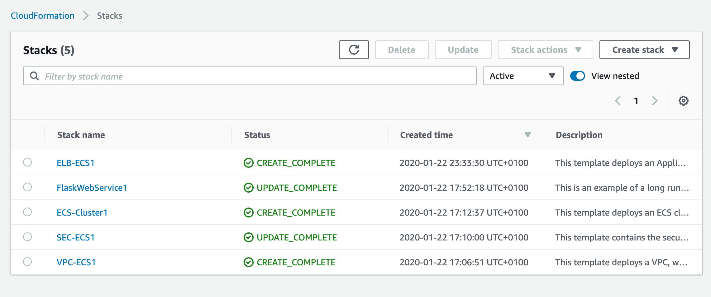
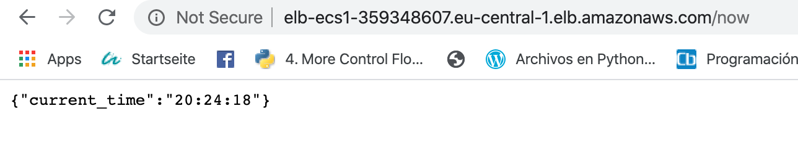

# DevOps Coding Test

Microservice using Amazon ECS, AWS CloudFormation, and a load balancer.

The goal is to create a docker microservice in Amazon ECS and a healthcheck script to verify its status by means of the following guidelines:
- Publicly accesible on port 80
- Returning the current time in json format on /now
- Deployment by using CloudFormation, and a server configuration management tool if needed (Ansible will be used).
- A healthcheck python script in that can be run externally to periodically check if the service is up and its clock is not desynchronised by more than 1 second.

### Prerequisites 📋


First, some things you will need:

```
Ansible at least 2.7
Amazon console api
An Amazon AWS account
IAM credentials to login to the AWS account (will be provided)
Python 3+
Virtualenv
```

For reference, the webservice was deployed by using MacOS Mojave 10.14.5.

### Overview 🔧

The repository contains a set of templates launching the following:

 - A [VPC](http://docs.aws.amazon.com/AmazonVPC/latest/UserGuide/VPC_Introduction.html) with public and private subnets, spanning an AWS region.
 - A highly available ECS cluster deployed across two [Availability Zones](http://docs.aws.amazon.com/AWSEC2/latest/UserGuide/using-regions-availability-zones.html) in an [Auto Scaling](https://aws.amazon.com/autoscaling/) group and that are AWS SSM enabled.
 - A pair of [NAT gateways](http://docs.aws.amazon.com/AmazonVPC/latest/UserGuide/vpc-nat-gateway.html) (one in each zone) to handle outbound traffic.
 - One microservice deployed as [ECS service](http://docs.aws.amazon.com/AmazonECS/latest/developerguide/ecs_services.html) (WebService using Flask python Web framework). 
 - An [Application Load Balancer (ALB)](https://aws.amazon.com/elasticloadbalancing/applicationloadbalancer/) to the public subnets to handle inbound traffic.
 - ALB path-based routes for each ECS service to route the inbound traffic to the correct service.
 - Centralized container logging with [Amazon CloudWatch Logs](http://docs.aws.amazon.com/AmazonCloudWatch/latest/logs/WhatIsCloudWatchLogs.html).

## Deployment 📦

Configure amazon keys (aws_secret_key and aws_access_key) which can be retrieved from amazon console for your user:
```
$ aws configure
AWS Access Key ID [None]: aws_access_key
AWS Secret Access Key [None]: aws_secret_key
Default region name [None]: us-west-2
Default output format [None]: json
```

The orchestration as well as deployment happen through ansible, thus, you can trigger it as follows:
```
ansible-playbook main.yml
```

it will then use the next templates:

| Template | Description |
| --- | --- | 
| [infrastructure/vpc.yaml](infrastructure/vpc.yaml) | this does not only orchestrates a VPC including a pair of public and private subnets distributed across two Availability Zones, but it also deploys an [Internet gateway](http://docs.aws.amazon.com/AmazonVPC/latest/UserGuide/VPC_Internet_Gateway.html), with a default route on the public subnets. Moreover, a pair of NAT gateways (one in each zone), and default routes for them in the private subnets are deployed. |
| [infrastructure/security-groups.yaml](infrastructure/security-groups.yaml) | It is possible to configure the [security groups](http://docs.aws.amazon.com/AmazonVPC/latest/UserGuide/VPC_SecurityGroups.html) required by the entire stack on this template.|
| [infrastructure/load-balancers.yaml](infrastructure/load-balancers.yaml) | Launches an ALB to the public subnets exposing the ECS services.|
| [infrastructure/ecs-cluster.yaml](infrastructure/ecs-cluster.yaml) | Deploys an ECS cluster attaching the private subnets to it by using an Auto Scaling group and installs an AWS SSM agent with related policy requirements. |
| [services/WebService.yaml](services/WebService.yaml) | this deploys an ECS service using a customized image from an amazon ecr registry. Furthermore, the Docker webservice shows the current time on /now . The source for this service is here [services/app](services/app/). |

Output is as follows:
```
PLAY [localhost] ******************************************************************************************************************************

TASK [Create VPC with pair of public and private subnets accross two AZ zones and an internet Gateway with default route] *********************
ok: [localhost]

TASK [Creating security groups] ***************************************************************************************************************
ok: [localhost]

TASK [Create load balancer] *******************************************************************************************************************
ok: [localhost]

TASK [Create ECS Cluster for containers] ******************************************************************************************************
ok: [localhost]

TASK [Create FlaskWebService with python] *****************************************************************************************************
ok: [localhost]
```

## Testing ⚙️

The infrastructure orchestration can be depicted next:


Web service in action:


### Adjusting ECS instance Type

This is specified in the main ansible playbook (main.yml)

By default, [t2.micro](https://aws.amazon.com/ec2/instance-types/) instances are utilized and can be changed on the ansible main.yml file.

```
- name: Create ECS Cluster for containers
      cloudformation:
        stack_name: ECS-Cluster1
        ........
        template: "{{ ecs_cluster }}"
        template_parameters:
         .......
          InstanceType: t2.micro
          ClusterSize: 2
          .......
        region: eu-central-1
      register: ecs_cluster
```

The Auto Scaling group scaling policy given by default launches and maintains a cluster of 2 ECS hosts distributed across two Availability Zones (min: 2, max: 2, desired: 2). 

### Change the VPC or subnet IP ranges

This set of templates deploys the following network design:

| Item | CIDR Range | Usable IPs | Description |
| --- | --- | --- | --- |
| VPC | 10.180.0.0/16 | 65,536 | The whole range used for the VPC and all subnets |
| Public Subnet | 10.180.8.0/21 | 2,041 | The public subnet in the first Availability Zone |
| Public Subnet | 10.180.16.0/21 | 2,041 | The public subnet in the second Availability Zone |
| Private Subnet | 10.180.24.0/21 | 2,041 | The private subnet in the first Availability Zone |
| Private Subnet | 10.180.32.0/21 | 2,041 | The private subnet in the second Availability Zone |

Values can be modified within the ansible main.yml file.

```
 - name: Create VPC with pair of public and private subnets accross two AZ zones and an internet Gateway with default route
      cloudformation:
        stack_name: VPC-ECS1
        ........
        template: "{{ vpc_template }}"
        template_parameters:
          .........
          VpcCIDR: 10.180.0.0/16
          PublicSubnet1CIDR: 10.180.8.0/21
          PublicSubnet2CIDR: 10.180.16.0/21
          PrivateSubnet1CIDR: 10.180.24.0/21
          PrivateSubnet2CIDR: 10.180.32.0/21
        region: eu-central-1
      register: vpc_stack
```

## Running Healthcheck script
Create a python 3 virtual environment and install the requirenments by using the requirements.txt. 
Steps are shown next:
initialize the virtual environment with python 3:
```
virtualenv3 -p python3 .venv
```
Acvitvate the virtualenvironment:
```
source .venv/bin/activate
```
Install dependencies:
```
pip3 install -r requirements.txt
```
Run the healthcheck script by providing the Load balancer URL:
```
python3 status.py URL_SITE
    URL_SITE is the url from the load balancer
```
Output is as follows:
```
(.venv) ➜  WebServiceChallenge git:(master) ✗ python3 status.py http://URL/now
{'current_time': '20:11:51'}
-2208919689.0
21:11:51
-2208916089.0
today time is greater
http://URL/now        200

```
## License

Copyright 2011-2016 Amazon.com, Inc. or its affiliates. All Rights Reserved.

Licensed under the Apache License, Version 2.0 (the "License"). You may not use this file except in compliance with the License. A copy of the License is located at

[http://aws.amazon.com/apache2.0/](http://aws.amazon.com/apache2.0/)

or in the "license" file accompanying this file. This file is distributed on an "AS IS" BASIS, WITHOUT WARRANTIES OR CONDITIONS OF ANY KIND, either express or implied. See the License for the specific language governing permissions and limitations under the License.


## Built With 🛠️
* [Python](https://www.python.org/) - Interpreted programming language.
* [Flask web framework](https://flask.palletsprojects.com/en/1.0.x/) - Used to create the webservice in a more robust way (launches its own http server)
* [Cloudformation](https://docs.aws.amazon.com/AWSCloudFormation/latest/UserGuide/quickref-ecs.html) - Used to generate templates to deploy infrastructure in AWS.
* [Ansible](https://docs.ansible.com/ansible/latest/index.html) - Software configuration management tool to run the templates and launch any updates, basically an IT automation tool.

## Authors ✒️

* **Carlos Klinsmann** - *First Version*.

## Acknowledgements 🎁

* Github API & valuable resources.
* Inspiration on the GithHub template: https://gist.githubusercontent.com/Villanuevand/6386899f70346d4580c723232524d35a/raw/8028158f59ba1995b0ca1afd3173bac3df539ca0/README-espa%25C3%25B1ol.md
* Flask documentation.
* References like https://www.digitalocean.com/community/tutorials/how-to-use-web-apis-in-python-3, https://github.com/PyGithub/PyGithub

